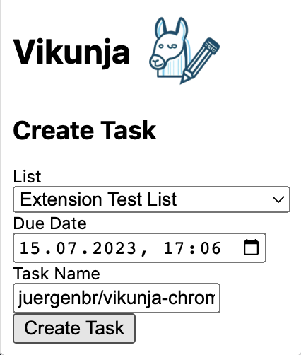
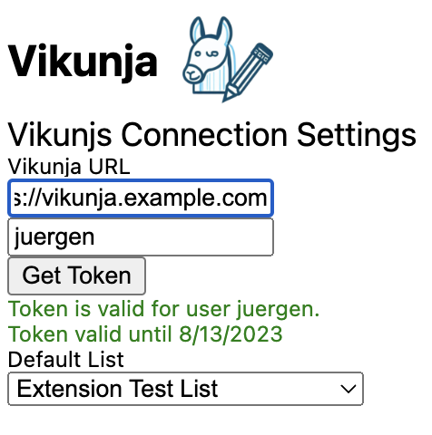

#  Vikunja Chrome Extrension (inofficial)

## Screenshots
 
 

## Features

- Login to your own Vikunja instance via the Extension options
- Display of token validity in the Extension options
- Setting of default list for storing new tasks
- Automatic selection of stored default list when popup is opened
- Setting of due date + reminder at due date

## Planned feautres
- Creating new note from selected text or link

## Install

[**Chrome** extension]()

## Contribution

Suggestions and pull requests are welcomed!.

---

This project was bootstrapped with [Chrome Extension CLI](https://github.com/dutiyesh/chrome-extension-cli)

